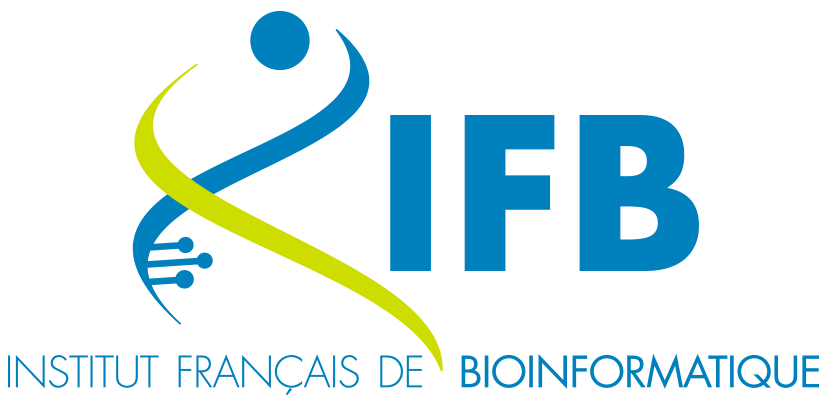
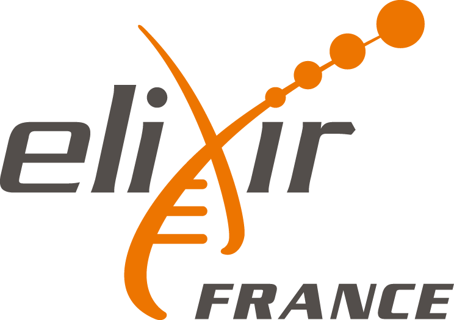
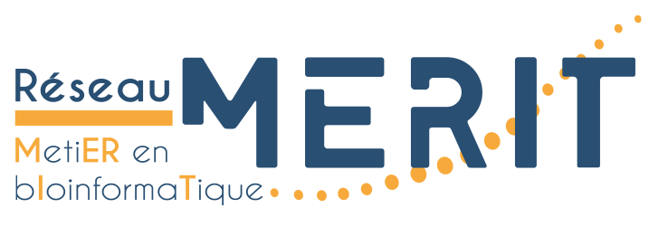

<table style="width: 600px; border: none;" cellpadding="10" align="center">
  <tr>
    <td align="center">
      
    </td>
    <td align="center">
      
    </td>
    <td align="center">
      
    </td>
    <td align="center">
      
    </td>
    <td align="center">
      
    </td>
  </tr>
</table>

# Colloque : Utilisation des IA génératives comme appui à la programmation et au scripting pour la biologie

Le 13 juin 2025, sur le campus des Grands Moulins, 75013 Paris.

## Exposés du matin

| Intervenant | Titre | Diaporama |
|----------|------------------------------------|:----:|
| Bertrand Cosson et Jacques van Helden | Introduction au colloque et aux ateliers pratiques | [pdf](slides/1-1_intro_colloque-IA_2025-06-13.pdf) |
| David Janiszek | Outils IA pour le scripting et le codage : évolution et perspectives	 | [pdf](slides/1-2_David-Janiszek_2025-06-13.pdf) |
| Guillaume Gautreau | Utilisation de grands modèles de langage génomique	 | [pdf](slides/1-3_Guillaume-Gautreau.pdf) |
| Pierre Poulain | Utilisation d’IA générative dans un processus pédagogique	 | [pdf](slides/1-4_Pierre-Poulain_IA-pedagogie_2025-06-13.pdf) |
| Nicolas Sabouret | Retour d’expérience sur l'utilisation de Github Copilot en cours de programmation | [pdf](slides/1-5_Nicolas-Sabouret_copilot-paris-cite_2025-06-13.pdf) |
| Sandrine Caburet | Adaptation pédagogique d'un pipeline RNAseq par Devin | [pdf](slides/2-1_Sandrine-Caburet-Devin_2025-06-13.pdf) |
| David Janisek | Présentation de Pléïade | Démo en direct |
| Vincent Ranwez | Accélérer sans déraper : maîtriser son code à l’ère de l’IA | [pdf](slides/2-3_Vincent-Ranwez_IA-bioscripting_2025-06-13.pdf) |

Vidéos de la matinée: <https://u-paris.zoom.us/rec/share/tF6DkEUbP_dZb6HatZm7HKqIRro42aUJmeiFmM4z44m99vmvpfGOswT7GXdpealJ.XAXhPRzQT2S0DjcO?startTime=1749798828000>

## Ateliers pratiques de l'après-midi

### Diaporama d'introduction aux deux ateliers

[3-1_acces-ressources-numeriques_atelier-IA-soft-biologie.pdf](slides/3-1_acces-ressources-numeriques_atelier-IA-soft-biologie.pdf)

- introduction aux ateliers pratiques
- accès aux ressources numériques utilisés pour la pratique
- présentation des deux ateliers

### Atelier 1 : Scripting pour la bioanalyse

- [Enoncé de l'exercice (en anglais)](exercise_yeast-cell-cycle)
- [Jeu de données de test](data/yeast-transcriptome-cell-cycle) : profils transcriptomiques montrant des fluctuations périodiques durant le cycle cellulaire de la levure
- [Dialogue avec l'IA générative](scripts/R/yeast-cell-cycle_ChatGPT-prompting.html)
- [R markdown pour exécuter les étapes du dialogue avec l'IA générative](scripts/R/yeast-cell-cycle_ChatGPT-prompting.Rmd)
- [Script R obtenu à la fin de la session pratique](scripts/R/yeast-cell-cycle_analysis_2025-06-13.R)

### Atelier 2 : Développement logiciel pour la biologie

- <https://ifb-elixirfr.github.io/IA-BioSoftware-Atelier/>

----

## Ressources numériques

| Ressource | Description | URL |
|-----------|----------------------------------------------|-------------------------------|
| Programme et inscriptions | Sur Sciencesconf |	https://iabioscripting.sciencesconf.org/ |
| Site Web | Support du colloque (sur github pages) | <https://ifb-elixirfr.github.io/AI-for-scripting-bioanalysis/> |
| Plateforme numérique Pléiade | IA génératives utilisées pour les ateliers pratiques de l'après-midi | <https://pleiade.mi.parisdescartes.fr/> |
| Cluster IFB-core | Environnement OnDemand (RStudio, JupyterHub) à disposition des participants pour les ateliers pratiques | <https://ondemand.cluster.france-bioinformatique.fr/> |
| Cluster IFB-core | demande de compte ou d'espaces-projets ; *des comptes temporaires seront fournis pour les ateliers pratiques, ce lien est utile uniquement si vous désirez continuer à utiliser le cluster après le colloque*	| <https://my.cluster.france-bioinformatique.fr/> |

----

## Organisation

Le colloque est organisé et financé par les trois organisations suivantes :

- Institut Français de Bioinformatique (IFB)
- Université Paris Cité (plateforme iPOP-UP et DU omiques)
- Réseau métier en bioinformatique (MERIT)

L'Institut Français de Bioinformatique (IFB) a été fondé par les Programme d'Investissements d'Avenir subventionné par l'Agence Nationale de la Recherche (RENABI-IFB, ANR-11-INBS-0013) et par le programme France 2030 relatifs aux équipements structurants pour la recherche / EQUIPEX+ (MUDIS4LS, ANR-21-ESRE-0048).

## Comité scientifique et de programmation

- [Bertrand Cosson](https://orcid.org/0000-0003-3401-7137) (Université Paris-Cité)
- [Jacques van Helden](https://orcid.org/0000-0002-8799-8584) (Institut Français de Bioinformatique, Aix-Marseille Université) 
- [Vincent Lefort](https://orcid.org/0000-0003-2864-4783) (réseau MERIT)
- [Imane Messak](https://orcid.org/0000-0002-1654-6652) (Institut Français de Bioinformatique)
- [Thomas Denecker](https://orcid.org/0000-0003-1421-7641) (Institut Français de Bioinformatique)

## Encadrants

### Atelier scripting pour la bioanalyse

- [Jacques van Helden](https://orcid.org/0000-0002-8799-8584) (Institut Français de Bioinformatique, Aix-Marseille Université) 
- [Vincent Ranwez](https://orcid.org/0000-0002-9308-7541) ([Institut Agro Montpellier](https://www.institut-agro-montpellier.fr/))
- [Fanny Casse](https://orcid.org/0000-0002-1196-2243) (Université Paris-Cité)
- [Gaëlle Lelandais](https://orcid.org/0000-0002-2842-6172) (Université Paris-Sud)
- [Pierre Poulain](https://orcid.org/0000-0003-4177-3619) (Université Paris-Cité)

## Atelier développement logiciel
- [Thomas Denecker](https://orcid.org/0000-0003-1421-7641) (Institut Français de Bioinformatique)
- [Imane Messak](https://orcid.org/0000-0002-1654-6652) (Institut Français de Bioinformatique)
- [Baptiste Rousseau](https://orcid.org/0009-0002-1723-2732) (Institut Français de Bioinformatique)

----

## Licence

[![CC BY-SA 4.0][cc-by-sa-shield]][cc-by-sa]

[![CC BY-SA 4.0][cc-by-sa-image]][cc-by-sa]

[cc-by-sa]: http://creativecommons.org/licenses/by-sa/4.0/
[cc-by-sa-image]: https://licensebuttons.net/l/by-sa/4.0/88x31.png
[cc-by-sa-shield]: https://img.shields.io/badge/License-CC%20BY--SA%204.0-lightgrey.svg

Maintained by [Jacques van Helden](https://orcid.org/0000-0002-4516-6509) 

