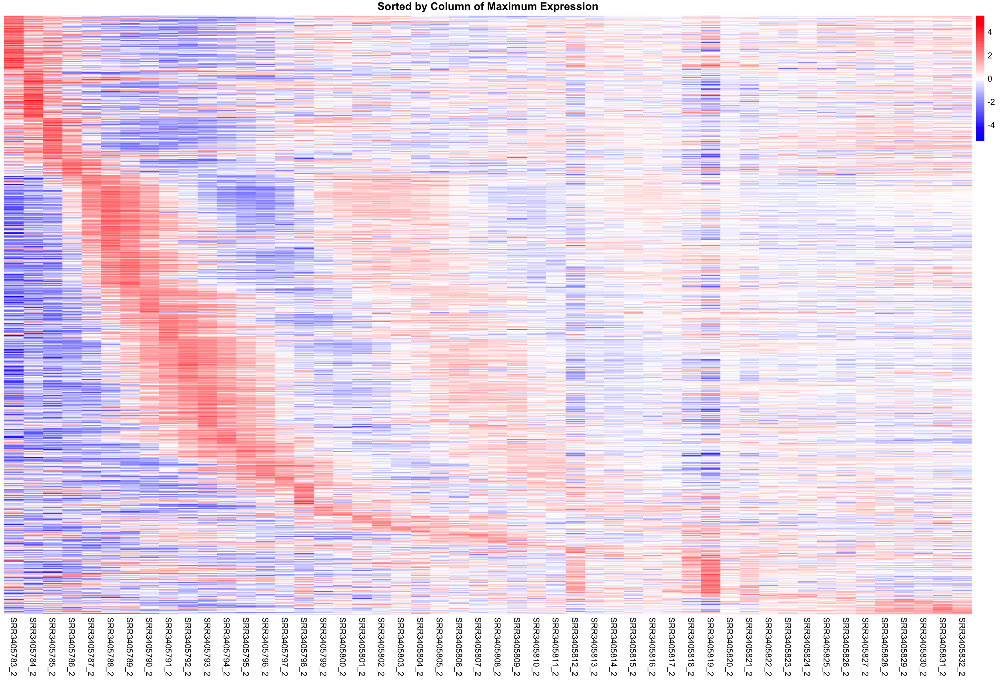

```{r setup, include=FALSE, size="huge"}
library(knitr)
## Default parameters for displaying the slides
knitr::opts_chunk$set(
  echo = TRUE, 
  eval=TRUE, 
  warning = TRUE, 
  results = TRUE, 
  message = TRUE, 
  fig.width = 7, 
  fig.height = 5, 
  fig.align = "center", 
  fig.path = "figures/",
  size = "tiny", 
  comment = "")

```


This file reproduces the dialog between the teacher (Jacques van Helden) and a generative AI (ChatGPT) 
to generate an R script to reproduce a figure from an article about a transcriptomic analysis of yeast cell cycle. 


## Prompting 

ChatGPT chat (made discoverable on June 15, 2025, I don't know how long it will remain available). 

- <https://chatgpt.com/share/684efb6e-4d00-8000-9bc4-2a618913e9d0>

### Step 1: downloading the data table

>Hi, I would like to write a script to download and analyse a tabular dataset.
>I would like to proceed by steps, and, for each step
>
>- write a function that runs the task corresponding to this step
>- write a unit test to make sure that this steps worked
>
>I will first try this in R (I will also do it later in Python).
>
>Some general recommendations :
>
- each function should be properly documented (in roxygen2 or another recommended standard)
- the code should be properly documented (explain the underlying logics)
- the code should be well structured, with separate functions for each task, and a section to specify the parameters. 
>
>Here is the first step: download a tab-separated file available at this URL: 
>
> https://ifb-elixirfr.github.io/AI-for-scripting-bioanalysis/data/yeast-transcriptome-cell-cycle/oscillating-genes_normalized-profiles.tsv
>
>The R script should
>
>- create a directory in my home, entitled “yeast-cell-cycle-analysisâ€
>- download the file
>- check that the file has been downloaded (test its presence in the directory, and check that it is not empty)
>
>Can you write the code to do this ?
>
>I will tell you later the next steps


Here is a clean and well-structured R script for Step 1: downloading and checking a dataset. The code includes:

- A function to perform the task
- A test function to verify the step worked
- Proper documentation using roxygen2 format
- Clear parameter section and inline comments


#### Directory structure suggestion:

Place your script in a file such as `01_download_data.R`, and later you can add 02_analyse_data.R, etc.

***Note: I name the script differently because I already know its general purpose, which I did not tell yet to ChatGPT.***

#### ✅ Code for Step 1

```{r download_data}

# Load necessary libraries
if (!requireNamespace("fs", quietly = TRUE)) install.packages("fs")
library(fs)

# ---- Parameters ----
DATA_URL <- "https://ifb-elixirfr.github.io/AI-for-scripting-bioanalysis/data/yeast-transcriptome-cell-cycle/oscillating-genes_normalized-profiles.tsv"
HOME_DIR <- path_home()
ANALYSIS_DIR <- path(HOME_DIR, "yeast-cell-cycle-analysis")
FILENAME <- "oscillating-genes_normalized-profiles.tsv"
FILE_PATH <- path(ANALYSIS_DIR, FILENAME)

# ---- Functions ----

#' Download and check yeast cell cycle dataset
#'
#' This function creates a target directory in the user's home folder,
#' downloads a tab-separated file from a public URL, and checks its presence and size.
#'
#' @param url The URL of the dataset to download.
#' @param target_dir The directory where the file should be saved.
#' @param filename The name to save the downloaded file as.
#' @return The path of the downloaded file if successful, otherwise throws an error.
#' @export
download_and_check_dataset <- function(url, target_dir, filename) {
  # Create the target directory if it doesn't exist
  if (!dir_exists(target_dir)) {
    dir_create(target_dir)
  }
  
  # Define the full path for the output file
  file_path <- path(target_dir, filename)
  
  # Download the file (overwrite = TRUE ensures re-download if needed)
  
  download.file(url, destfile = file_path, mode = "wb")
  
  # Check if the file exists and is not empty
  if (!file_exists(file_path)) {
    stop("File was not downloaded.")
  }
  if (file_info(file_path)$size == 0) {
    stop("Downloaded file is empty.")
  }
  
  return(file_path)
}

#' Unit test for dataset download function
#'
#' Tests that the file was correctly downloaded and is not empty.
#' Prints success message if test passes, otherwise stops.
#'
#' @return NULL (invisible), throws error if test fails
#' @export
test_download_and_check_dataset <- function() {
  cat("Running test for download_and_check_dataset...\n")
  file_path <- download_and_check_dataset(DATA_URL, ANALYSIS_DIR, FILENAME)
  
  if (!file_exists(file_path)) {
    stop("Test failed: File does not exist.")
  }
  if (file_info(file_path)$size == 0) {
    stop("Test failed: File is empty.")
  }
  
  cat("✅ Test passed: File downloaded and is not empty.\n")
  invisible(NULL)
}

# ---- Run test ----
test_download_and_check_dataset()

```

#### Notes

Uses the `fs` package for cleaner and safer file handling (e.g. path_home, path, file_info)

You could eventually replace `download.file()` with `httr::GET()` or `curl::curl_download()` for more advanced handling (e.g. redirects, headers)

You can later wrap these steps in a `main()` function or split into a package structure

Let me know when you’re ready for the next step!

> The next step : 
>
>- load the data table
>- check the dimensions of the table
>- unit test  : it should contain 50 data columns
>
>Can you print here the functions to do that, and the calls that I will insert at the end of the script.

Perfect. Here's the next step of your R script, following the same structure: a documented function and its unit test.

### 📊 Step 2: Load the data and check dimensions

#### ✅ Functions to add:

```{r load_data_function} 
# ---- Additional Libraries ----
if (!requireNamespace("readr", quietly = TRUE)) install.packages("readr")
library(readr)

# ---- Step 2 Functions ----

#' Load the dataset from file
#'
#' Loads a tab-separated values (TSV) file into a data frame.
#'
#' @param file_path The full path to the TSV file.
#'
#' @return A data frame containing the dataset.
#' @export
load_dataset <- function(file_path) {
  # read_tsv automatically handles headers and parses columns
  df <- read_tsv(file_path, col_types = cols())
  return(df)
}

#' Unit test for dataset loading
#'
#' Loads the dataset and checks that it contains exactly 50 data columns
#' (excluding any annotation columns, if applicable).
#'
#' @param df The data frame loaded from the dataset.
#' @return NULL (invisible), throws error if test fails.
#' @export
test_dataset_dimensions <- function(df) {
  cat("Running test for dataset dimensions...\n")
  
  n_cols <- ncol(df)
  
  if (n_cols != 50) {
    stop(paste("Test failed: Expected 50 columns, got", n_cols))
  }
  
  cat("✅ Test passed: Dataset contains 50 columns.\n")
  invisible(NULL)
}

```

#### 🔚 Add this at the end of your script to run step 2


```{r load_data}
# ---- Run Step 2 ----
df <- load_dataset(FILE_PATH)
test_dataset_dimensions(df)

```

#### 🔠Notes

The use of `readr::read_tsv()` ensures fast and safe parsing with automatic column typing.

This function assumes the table contains only 50 columns (i.e., no metadata or rowname columns). If the table includes identifiers or labels, we can adapt the test to check for 50 data columns instead.

Let me know if you want to refine the column-count check (e.g., excluding gene names or IDs), or when you're ready for the next step.

> The first column contains the row names, could you modify the loading function ?

Yes, absolutely — if the first column contains row names (e.g., gene identifiers), we should:

- Load that first column explicitly as row names.
- Ensure the resulting data frame has 50 actual data columns (excluding the row names).

#### ✅ Modified load_dataset() function:

```{r load_data_function_2}
#' Load the dataset from file, using first column as row names
#'
#' Loads a tab-separated values (TSV) file into a data frame, treating the first column
#' as row names (e.g., gene identifiers).
#'
#' @param file_path The full path to the TSV file.
#'
#' @return A data frame with gene identifiers as row names and expression data as columns.
#' @export
load_dataset <- function(file_path) {
  # Read the full file first
  raw_df <- read_tsv(file_path, col_types = cols())
  
  # Convert the first column to row names
  rownames_df <- as.data.frame(raw_df)
  rownames(rownames_df) <- rownames_df[[1]]
  rownames_df[[1]] <- NULL  # Remove the now-redundant first column
  
  return(rownames_df)
}

```

#### ✅ Modified test function (no change needed):

```{r load_data_unit_test}
#' Unit test for dataset loading
#'
#' Loads the dataset and checks that it contains exactly 50 data columns
#' (excluding the row names).
#'
#' @param df The data frame loaded from the dataset.
#' @return NULL (invisible), throws error if test fails.
#' @export
test_dataset_dimensions <- function(df) {
  cat("Running test for dataset dimensions...\n")
  
  n_cols <- ncol(df)
  
  if (n_cols != 50) {
    stop(paste("Test failed: Expected 50 columns, got", n_cols))
  }
  
  cat("✅ Test passed: Dataset contains 50 data columns.\n")
  invisible(NULL)
}

```

#### 🔚 Call at the end of the script:

```{r eval=FALSE}
# ---- Run Step 2 ----
df <- load_dataset(FILE_PATH)
test_dataset_dimensions(df)

```

Let me know when you're ready for Step 3 — e.g., basic summary stats, normalization checks, or filtering.


#### Error handled manually

**Note: At this stage the program issued an error, and I had to fix it manually. **

```
Error in `test_dataset_dimensions()`:
! Test failed: Expected 50 columns, got 49
Backtrace:
    â–†
 1. └─global test_dataset_dimensions(df)

Quitting from yeast-cell-cycle_ChatGPT-prompting.Rmd:315-320 [unnamed-chunk-6]
Execution halted
```
**Fix: 

```{r load_data_function_fixed}
# ---- Step 2 Functions ----

#' Load the dataset from file
#'
#' Loads a tab-separated values (TSV) file into a data frame.
#'
#' @param file_path The full path to the TSV file.
#'
#' @return A data frame containing the dataset.
#' @export
load_dataset <- function(file_path) {
  # read_tsv automatically handles headers and parses columns
  #   df <- read_tsv(file_path, col_types = cols())

  # The following line was manually implemented by Jacques van Helden, 
  # because the initial code was not working, read_tsv was merging the 
  # two last columsns into a single one. After several unsuccessful attempts 
  # to get a fix from ChatGPT,I rewrote the line maually with read.csv
  df <- read.csv(file_path, header=TRUE, row.names=1, sep="\t")
  return(df)
}

```

**After this fix, the data was properly loaded. **

```{r load_data_fixed}
# ---- Run Step 2 ----
df <- load_dataset(FILE_PATH)
test_dataset_dimensions(df)

```

### Step 3: data normalization and standardization

>I would now like to produce a normalised data table from the counts, by applying the following transformations. 
>
>1. log2 transformation. To avoid problems with 0 values, let us define y <- log2(x + 1)
>2. row-wise standardization : for each row, z <-(y - mean(y)) / sd(y)
>
>Can you write a function that takes as input the original data frame, and returns the normalised data frame ?

Certainly! Here's a function that applies the two-step normalization to a numeric data frame:

- **Log2(x + 1)** transformation to reduce skew and stabilize variance

- **Row-wise standardization** to center and scale each row (gene profile)

The output is a data frame with the same dimensions, containing normalized values.


#### ✅ Function: normalize_expression_data

```{r normalize_data_function}
#' Normalize gene expression data
#'
#' Applies a two-step normalization procedure to a data frame of gene expression values:
#' 1. Log2 transformation with pseudocount: y = log2(x + 1)
#' 2. Row-wise standardization: z = (y - mean(y)) / sd(y)
#'
#' @param df A numeric data frame where rows represent genes and columns represent samples.
#'           Row names must be gene identifiers.
#'
#' @return A data frame of the same shape with normalized expression values.
#' @export
normalize_expression_data <- function(df) {
  if (!is.data.frame(df)) stop("Input must be a data frame.")
  
  # Step 1: log2(x + 1) transformation
  log_transformed <- log2(df + 1)
  
  # Step 2: row-wise standardization
  row_standardized <- t(apply(log_transformed, 1, function(row) {
    m <- mean(row, na.rm = TRUE)
    s <- sd(row, na.rm = TRUE)
    if (s == 0) {
      rep(0, length(row))  # avoid division by zero: return zeros if sd == 0
    } else {
      (row - m) / s
    }
  }))
  
  # Convert matrix back to data frame and preserve row and column names
  result_df <- as.data.frame(row_standardized)
  rownames(result_df) <- rownames(df)
  colnames(result_df) <- colnames(df)
  
  return(result_df)
}

#### 🔬 Example of how to use this (add at the end of your script):
```


```{r normalize_data}
# ---- Step 3: Normalize data ----
normalized_df <- normalize_expression_data(df)
```

#### 📠Notes:

- This function handles the case where `sd = 0` for a row (e.g., constant values): it replaces the result with a vector of zeros.

- It uses `apply()` with `MARGIN = 1` to operate row-wise.

- If you ever expect missing values (NAs), you could add further cleaning steps (e.g., imputation or row filtering).


Let me know if you'd like to include a **unit test** for this step (e.g., check the output has zero mean and unit sd per row).

> Could you write a unit test for this function, that checks that the mean of each row is 0 (plus or minus some epsilon, e.g. e-12) and that the sd is 1 (with the same epsilon)?

Absolutely! Below is a **unit test** function that checks:

- the **row means** of the normalized data are close to 0 (within a small epsilon),

- the **row standard deviations** are close to 1 (within the same epsilon),

- and reports whether the test passed or failed.

#### ✅ Unit Test: test_normalized_data

```{r test_normalized_data_function}
#' Unit test for normalized expression data
#'
#' Verifies that each row of the normalized data has approximately zero mean
#' and unit standard deviation (within a given tolerance).
#'
#' @param norm_df A data frame returned by `normalize_expression_data()`.
#' @param epsilon A numeric tolerance for floating-point comparisons (default = 1e-12).
#' @return NULL (invisible), throws an error if test fails.
#' @export
test_normalized_data <- function(norm_df, epsilon = 1e-12) {
  cat("Running test for normalized expression data...\n")
  
  # Compute row means and standard deviations
  row_means <- rowMeans(norm_df, na.rm = TRUE)
  row_sds   <- apply(norm_df, 1, sd, na.rm = TRUE)
  
  # Check if all means are approximately 0
  if (any(abs(row_means) > epsilon)) {
    failed_rows <- sum(abs(row_means) > epsilon)
    stop(paste("Test failed:", failed_rows, "row means differ from 0 by more than", epsilon))
  }
  
  # Check if all standard deviations are approximately 1
  if (any(abs(row_sds - 1) > epsilon)) {
    failed_rows <- sum(abs(row_sds - 1) > epsilon)
    stop(paste("Test failed:", failed_rows, "row standard deviations differ from 1 by more than", epsilon))
  }
  
  cat("✅ Test passed: all rows have mean ~ 0 and sd ~ 1 (±", epsilon, ").\n")
  invisible(NULL)
}

```

#### 🔚 Call this after normalization:

```{r test_normalized_data}
# ---- Step 3: Normalize data and test ----
normalized_df <- normalize_expression_data(df)
test_normalized_data(normalized_df)

```

Let me know when you're ready for the next step — we could explore clustering, PCA, timepoint selection, or visualization.


### Step 4: heatmap drawing

>Can you write a function that takes as input a data frame and produces a heatmap with the genes in rows, the time points in columns (vertical labels) ? The color scale should preferably go from cyan (low values) to yellow (high values). 
>
>Then a line to generate the heatmap at different steps of the analysis
>- data before normalisation
>- normalised data

Absolutely! Here's a complete function to produce a heatmap from a data frame, with the following requirements:

- Genes in rows, time points in columns
- Vertical column labels (time points at top or bottom)
- Custom color scale from cyan (low) to yellow (high)

I'll use `pheatmap`, a popular and simple R package. Let me know if you'd prefer using `ggplot2`, `ComplexHeatmap`, or base R instead .

#### 📦 Prerequisites

If `pheatmap` is not installed:

```{r install_pheatmap, eval=FALSE}
install.packages("pheatmap")
```

#### ✅ Heatmap function: plot_expression_heatmap()


```{r plot_expression_heatmap_function}
#' Plot a heatmap of gene expression data
#'
#' Produces a heatmap from a data frame, with genes in rows and samples/time points in columns.
#' Uses a color scale from cyan (low values) to yellow (high values).
#'
#' @param df A numeric data frame with genes as rows and samples as columns.
#' @param title A title for the heatmap (optional).
#'
#' @return None. The function plots a heatmap.
#' @export
plot_expression_heatmap <- function(df, title = "Expression Heatmap") {
  if (!requireNamespace("pheatmap", quietly = TRUE)) {
    stop("Package 'pheatmap' is required. Please install it with install.packages('pheatmap').")
  }
  
  # Custom color scale from cyan to yellow
  color_scale <- colorRampPalette(c("cyan", "black", "yellow"))(100)
  
  # Draw heatmap
  pheatmap::pheatmap(
    mat = as.matrix(df),
    color = color_scale,
    cluster_rows = TRUE,
    cluster_cols = TRUE,
    show_rownames = FALSE,
    show_colnames = TRUE,
    fontsize_col = 10,
    main = title,
    border_color = NA
  )
}

```

#### 📊 Usage: heatmaps before and after normalization

At the end of your script, add:

```{r plot_expression_raw_normalized}
# ---- Step 4: Heatmaps ----

# Heatmap before normalization
plot_expression_heatmap(df, title = "Raw Expression Data")

# Heatmap after normalization
plot_expression_heatmap(normalized_df, title = "Normalized Expression Data")

```


Let me know if you'd like to:

- sort genes by peak time or clustering order,
- annotate time points or gene classes,
- export figures to files,
- or use ggplot2 for greater control.


**Note: this feedback is quite remarkable, ChatGPT already anticipate what we had defined as the next steps during the preparatory brain storming, and proposes even more (annotating time points or gene classes). **

>What it pheatmap is already installed ? Can you write a column that does it only if not installed yet ? and loads it

Certainly! You can conditionally install and then load pheatmap with the following snippet at the top of your script or before calling the heatmap function:

#### 📦 Conditional install & load for pheatmap

```{r install_pheatmap_if_required}
# Check if 'pheatmap' is installed; install if not, then load
if (!requireNamespace("pheatmap", quietly = TRUE)) {
  install.packages("pheatmap")
}
library(pheatmap)
```

#### 🔄 Reusable utility function (optional)

```{r ensure_package}
#' Ensure that a package is installed and loaded
#'
#' @param pkg The name of the package to install and load.
#' @export
ensure_package <- function(pkg) {
  if (!requireNamespace(pkg, quietly = TRUE)) {
    install.packages(pkg)
  }
  library(pkg, character.only = TRUE)
}

# Example usage
ensure_package("pheatmap")

```

This ensures pheatmap is available and loaded without redundant installation.

Let me know if you'd like a version of the heatmap function that uses ggplot2 or saves the heatmap to a file!


>I would like a heatmap that preserves the order of the rows and columns

Great! To preserve the order of rows and columns in a heatmap using `pheatmap`, you simply need to disable clustering by setting:

```{r eval=FALSE}
cluster_rows = FALSE
cluster_cols = FALSE
```


#### ✅ Updated heatmap function: plot_expression_heatmap()

```{r plot_expression_heatmap_function_2}
#' Plot a heatmap of gene expression data (with fixed row/column order)
#'
#' Produces a heatmap from a data frame, with genes in rows and samples/time points in columns.
#' Preserves the order of rows and columns as they appear in the data frame.
#' Uses a color scale from cyan (low values) to yellow (high values).
#'
#' @param df A numeric data frame with genes as rows and samples as columns.
#' @param title A title for the heatmap (optional).
#'
#' @return None. The function plots a heatmap.
#' @export
plot_expression_heatmap <- function(df, title = "Expression Heatmap") {
  # Ensure the 'pheatmap' package is installed and loaded
  if (!requireNamespace("pheatmap", quietly = TRUE)) {
    install.packages("pheatmap")
  }
  library(pheatmap)

  # Color scale from cyan (low) → black → yellow (high)
  color_scale <- colorRampPalette(c("cyan", "black", "yellow"))(100)

  # Plot the heatmap without clustering
  pheatmap::pheatmap(
    mat = as.matrix(df),
    color = color_scale,
    cluster_rows = FALSE,
    cluster_cols = FALSE,
    show_rownames = FALSE,
    show_colnames = TRUE,
    fontsize_col = 10,
    main = title,
    border_color = NA
  )
}

```

#### 📊 Usage (unchanged)


```{r plot_expression_raw_normalized_2}
# Heatmap before normalization (preserves column order from original file)
plot_expression_heatmap(df, title = "Raw Expression Data")

# Heatmap after normalization (preserves same order)
plot_expression_heatmap(normalized_df, title = "Normalized Expression Data")

```

Let me know if you want to:

- manually specify the order of genes or time points,
- add row/column annotations,
- export to PNG/PDF/SVG automatically,
- or switch to ggplot2 for publication-grade control.

>I would like to sort the genes (rows) according to a simple criterion, and test three successive options. 
>
>Could you write a function for each of these approaches ?
>
>1. Order genes by decreasing order of their value in a user-specified column (default : 1st column)
>2. Use PCA transform, and use the first component to order the genes
>3. Use Fourrier transform to order genes according to the phase of expression (in this particular dataset, genes levels show  a cyclic oscillations during 3 successive cell cycles)

Perfect — these are all valid and insightful strategies to reorder rows in a heatmap of oscillatory gene expression data. Below are the three functions, each one sorting the rows of a data frame (genes × timepoints) according to your chosen criterion. Each returns a reordered data frame, keeping the same column order.

#### 🔧 Setup

All functions assume:

- Rows = genes
- Columns = time points (numeric)
- Data is already numeric and normalized (recommended for PCA/FFT)

#### 1. 🔢 Sort by value in a given column

```{r order_genes_by_column_function}
#' Order genes by decreasing expression in a given column
#'
#' @param df A data frame with genes in rows and samples/time points in columns.
#' @param col_index Column to use for sorting (default = 1)
#'
#' @return A reordered data frame
#' @export
order_genes_by_column <- function(df, col_index = 1) {
  df[order(-df[[col_index]]), ]
}

```

#### 2. 📈 Sort by first principal component (PCA)

```{r order_genes_by_pca_function}
#' Order genes by their projection on the first principal component (PCA)
#'
#' @param df A data frame with genes in rows and samples in columns.
#'
#' @return A reordered data frame
#' @export
order_genes_by_pca <- function(df) {
  pca <- prcomp(df, center = TRUE, scale. = TRUE)
  pc1_scores <- pca$x[, 1]  # projections of each gene on PC1
  df[order(pc1_scores), ]
}

```

#### 3. 🔠Sort by phase of the Fourier transform

```{r order_genes_by_fft_phase_function}
#' Order genes by the phase of the dominant frequency component (FFT)
#'
#' Assumes that the expression pattern follows a periodic signal.
#' Rows (genes) are sorted by the phase of the strongest non-zero frequency.
#'
#' @param df A data frame with genes in rows and samples in columns.
#'
#' @return A reordered data frame
#' @export
order_genes_by_fft_phase <- function(df) {
  get_phase <- function(row) {
    fft_result <- fft(row)
    # Ignore DC component (index 1), get dominant frequency component
    magnitudes <- Mod(fft_result)[2:floor(length(fft_result)/2)]
    phases <- Arg(fft_result)[2:floor(length(fft_result)/2)]
    dominant_idx <- which.max(magnitudes)
    phases[dominant_idx]
  }
  
  phases <- apply(df, 1, get_phase)
  df[order(phases), ]
}

```

#### 📊 Usage Example

Let’s say your normalized data is stored in `normalized_df`:

```{r plot_ordered_genes}
# Order genes by different methods
df_col_sorted <- order_genes_by_column(normalized_df, col_index = 1)
df_pca_sorted <- order_genes_by_pca(normalized_df)
df_fft_sorted <- order_genes_by_fft_phase(normalized_df)

# Plot heatmaps
plot_expression_heatmap(df_col_sorted, title = "Sorted by Expression (1st Column)")
plot_expression_heatmap(df_pca_sorted, title = "Sorted by PCA Component 1")
plot_expression_heatmap(df_fft_sorted, title = "Sorted by FFT Phase")

```

Let me know if:

- You want PCA to be run on transposed data (i.e., genes as variables, time points as observations — not typical here)
- You want to apply smoothing or zero-padding before FFT
- You want to annotate genes by phase group after sorting
- Would you like unit tests for these sorting functions as well?

>Can you export each plot in a high-resolution png file, with at least 1 pixel per gene ?

Yes — to export each heatmap to a high-resolution PNG file, you can wrap your plotting function in a call to png() and specify the image dimensions so that:

- Image height ≥ number of genes (rows) → ensures at least 1 pixel per gene.
- Image width ≥ number of time points (columns) → ensures visibility of labels.

#### ✅ Updated version of plot_expression_heatmap() with PNG export

```{r plot_expression_heatmap_to_png_function}
#' Plot and export a heatmap of gene expression data
#'
#' Exports a heatmap as a high-resolution PNG image.
#' Preserves the order of rows and columns.
#'
#' @param df A numeric data frame (genes × time points).
#' @param filename Output PNG filename.
#' @param title Optional title for the plot.
#' @param pixel_per_gene Vertical resolution (default = 1 pixel/gene).
#' @param pixel_per_timepoint Horizontal resolution (default = 30 pixels/column).
#'
#' @return None. A PNG file is created.
#' @export
plot_expression_heatmap_to_png <- function(df, filename, title = NULL,
                                           pixel_per_gene = 1,
                                           pixel_per_timepoint = 30) {
  # Ensure pheatmap is available
  if (!requireNamespace("pheatmap", quietly = TRUE)) {
    install.packages("pheatmap")
  }
  library(pheatmap)

  n_genes <- nrow(df)
  n_timepoints <- ncol(df)

  # Compute image size (in pixels)
  height_px <- max(800, n_genes * pixel_per_gene)
  width_px <- max(800, n_timepoints * pixel_per_timepoint)

  # Start PNG device
  png(filename, width = width_px, height = height_px, res = 150)

  # Heatmap colors
  color_scale <- colorRampPalette(c("cyan", "black", "yellow"))(100)

  # Plot
  pheatmap::pheatmap(
    mat = as.matrix(df),
    color = color_scale,
    cluster_rows = FALSE,
    cluster_cols = FALSE,
    show_rownames = FALSE,
    show_colnames = TRUE,
    fontsize_col = 10,
    main = title,
    border_color = NA
  )

  dev.off()
}

```

#### 📊 Example usage

```{r plot_heatmaps}
# Save heatmaps to PNG with 1 pixel per gene
plot_expression_heatmap_to_png(df_col_sorted, "heatmap_sorted_by_column.png",
                               title = "Sorted by Expression (1st Column)")

plot_expression_heatmap_to_png(df_pca_sorted, "heatmap_sorted_by_pca.png",
                               title = "Sorted by PCA Component 1")

plot_expression_heatmap_to_png(df_fft_sorted, "heatmap_sorted_by_fft.png",
                               title = "Sorted by FFT Phase")

```

#### 💡 Tips


- pixel_per_gene = 1 ensures legibility with minimal vertical size.
- Increase to 2 or 4 for better readability or publication export.
- For even sharper output, increase res from 150 to 300.

Would you like a PDF version export as well?

>Could you  write a 4th function taht orders genes according to the time point of their max of expression ?

#### 🧬 Function 4 — Order by time of maximum expression

This function:

- Identifies the column (i.e., time point) where each gene reaches its maximum.

- Orders the rows (genes) by increasing time of their peak.


```{r order_genes_by_peak_time_function}
#' Order genes by the time point (column index) of their maximum expression
#'
#' @param df A numeric data frame (genes in rows, time points in columns)
#'
#' @return A reordered data frame, sorted by time of maximum expression
#' @export
order_genes_by_peak_time <- function(df) {
  peak_times <- apply(df, 1, which.max)  # which column has the max value for each row
  df[order(peak_times), ]
}

```

#### 🔠Example usage

```{r order_genes_by_peak_time}
df_peak_sorted <- order_genes_by_peak_time(normalized_df)

plot_expression_heatmap_to_png(df_peak_sorted,
  filename = "heatmap_sorted_by_peak_time.png",
  title = "Sorted by Time of Maximum Expression"
)

```

Let me know if you'd prefer the peak time to be based on actual time labels (e.g. minutes or hours) rather than column indices, in which case we could modify the function to use named columns or numeric time labels if available.


>Could you adapt the heatmap in order to use a 3-color scale with red (max value) - white (0 value) - blue (min value) ?

Absolutely! You can modify the heatmap color scale to use a three-color gradient from blue (low) → white (0) → red (high) using colorRamp2() from the circlize package or a custom colorRampPalette() for simple midpoint scales.

Here’s an updated version using `pheatmap` and a centered three-color scale:

#### ✅ Updated plot_expression_heatmap_to_png() with red–white–blue color scale

```{r plot_expression_heatmap_to_png_function_2}
#' Plot and export a heatmap with red-white-blue color scale
#'
#' @param df A numeric data frame (genes × time points)
#' @param filename Output PNG filename
#' @param title Optional title for the plot
#' @param pixel_per_gene Vertical resolution (default = 1 pixel/gene)
#' @param pixel_per_timepoint Horizontal resolution (default = 30 pixels/column)
#'
#' @return None. A PNG file is created
#' @export
plot_expression_heatmap_to_png <- function(df, filename, title = NULL,
                                           pixel_per_gene = 1,
                                           pixel_per_timepoint = 30) {
  # Load pheatmap if not yet loaded
  if (!requireNamespace("pheatmap", quietly = TRUE)) {
    install.packages("pheatmap")
  }
  library(pheatmap)

  # Create red-white-blue color scale centered on 0
  max_val <- max(df, na.rm = TRUE)
  min_val <- min(df, na.rm = TRUE)
  abs_max <- max(abs(min_val), abs(max_val))  # symmetric scale
  breaks <- seq(-abs_max, abs_max, length.out = 101)
  color_scale <- colorRampPalette(c("blue", "white", "red"))(100)

  # Compute dimensions
  n_genes <- nrow(df)
  n_timepoints <- ncol(df)
  height_px <- max(800, n_genes * pixel_per_gene)
  width_px <- max(800, n_timepoints * pixel_per_timepoint)

  # Export heatmap as PNG
  png(filename, width = width_px, height = height_px, res = 150)

  pheatmap::pheatmap(
    mat = as.matrix(df),
    color = color_scale,
    breaks = breaks,
    cluster_rows = FALSE,
    cluster_cols = FALSE,
    show_rownames = FALSE,
    show_colnames = TRUE,
    fontsize_col = 10,
    main = title,
    border_color = NA
  )

  dev.off()
}

```

#### 🧪 Example usage

```{r plot_heatmap_sorted_by_peak_time}
plot_expression_heatmap_to_png(df_peak_sorted,
  filename = "heatmap_sorted_by_peak_time_rwb.png",
  title = "Sorted by Time of Maximum Expression (Red–White–Blue)"
)
```


Let me know if you want:

- The scale centered on another value (e.g., mean(df)).
- A continuous color bar legend from min to max.
- A PDF export version with the same settings.

> Could you write a fourth function to order gene according to the column of their max of expression ?

  
Yes — below is the 4th function to order genes by the column index (i.e., time point) of their maximum expression.

This function is essentially what you described earlier (and is consistent with what we discussed above):


#### 🔢 Function 4 — Order genes by the column of their maximum expression

```{r order_genes_by_max_column_function}
#' Order genes by the time point (column index) of their maximum expression
#'
#' This function finds the column (time point) where each gene reaches
#' its maximum expression, and orders genes accordingly.
#'
#' @param df A numeric data frame (genes in rows, time points in columns)
#'
#' @return A reordered data frame, sorted by column index of maximum expression
#' @export
order_genes_by_max_column <- function(df) {
  # For each gene (row), find the column index of its maximum value
  max_columns <- apply(df, 1, which.max)

  # Order the rows (genes) by increasing column index of max expression
  df[order(max_columns), ]
}

```

#### 🔠Example usage

```{r heatmap_sorted_by_max_column}
# Apply the ordering
df_sorted_maxcol <- order_genes_by_max_column(normalized_df)

# Plot the heatmap
plot_expression_heatmap_to_png(
  df_sorted_maxcol,
  filename = "heatmap_sorted_by_max_column.png",
  title = "Sorted by Column of Maximum Expression"
)

```

Let me know if you want a variant that uses time labels instead of column indices, or combines several criteria (e.g., peak time and amplitude).


## Results at the end of the practical session (June 13, 2025)


### R script generated by ChatGPT

This is the script in the state we reached at the end of the practical session. I only edited one line manyally  (`read.csv`), all the rest of the code was progressively written by ChatGPT during the step-by-step prompting reported above. 

[yeast-cell-cycle_analysis_2025-06-13.R](yeast-cell-cycle_analysis_2025-06-13.R)

### Figures


#### Genes sorted based on the first column of the expression table


#### Genes sorted based on the second column of the expression table


#### Genes sorted based on the first component of PCA-transformed data


#### Genes sorted based on Fourrier transform


#### Genes sorted based on the column with their max value




## Post-session improvements

Hereby some suggestions of improvements that could be done with the help of the generative AI. 

- Unit test for data loading : check that the table contains 1705 rows, and that all the values are numeric
- Save the figure files in a separate subfolder
- Add a md5sum file to check file transfer integrity
- Avoid downloading the data table if it is already there
- Improve the heatmap color scale by adding a gamma function
- Use `ggplot2` to generate high-quality figures.
- Implement some other suggestions made by ChatGPT in the above dialog

